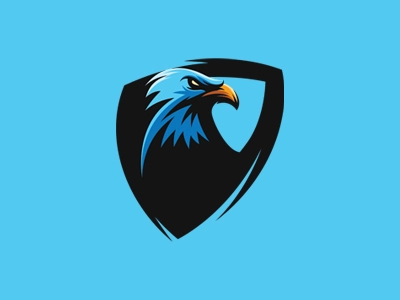

# Merlin

## What's this?
Merlin is a Discord bot that aims to keep your servers free from annoying phishing links by detecting known domains, this bot requires the [Backend API](https://github.com/NRGetRekt/Backend-API)

## Features
- Automatic detection of malicious links
- Redirection following (URL shorteners etc)
- Detect Discord login QR codes
- Choose what happens when a message is detected (delete, kick, ban)
- Report URLs
- Detect unauthorized @everyone mentions
- Fully selfhostable!

## Setup
- Install [Node.JS](https://nodejs.org/en/download)
- Clone the repository
- Install dependencies with ``npm install``
- Set your bot token in ``config.default.js``
- Start the bot with ``npm start``

### Updating
By executing ``npm run update`` you can automatically pull the GitHub repo, install new dependencies, and merge new config entries all at the same time.

## Credits
Projects being used:
- [Eris](https://github.com/abalabahaha/eris)
- [Colors.JS](https://github.com/Marak/colors.js)
- [extract-urls](https://github.com/huckbit/extract-urls)
- [cross-fetch](https://github.com/lquixada/cross-fetch)
- [LevelDB](https://github.com/Level/level)
- [ms](https://github.com/vercel/ms)
- [jimp](https://github.com/oliver-moran/jimp)
- [jsqrcode](https://github.com/edi9999/jsqrcode)

External API'S:
- [phish.sinking.yachts](https://phish.sinking.yachts/docs)
